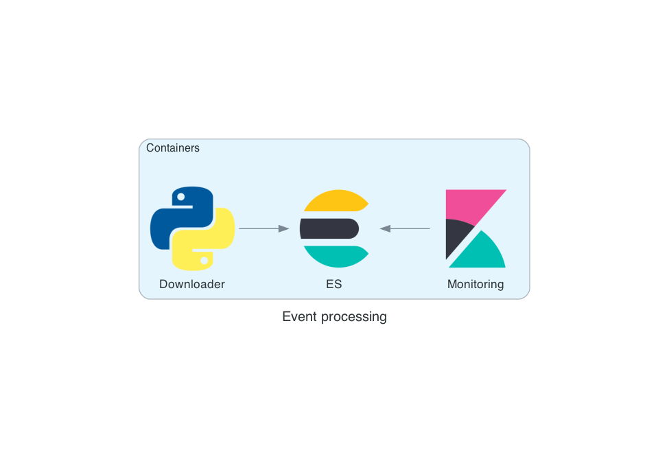

[](https://github.com/selimonat/benchmark/actions?query=workflow%3A"Unit+Tests")
# benchmark

Benchmark your stock portfolio against common metrics such as S&P500.

`benchmark` wants to answer a simple question: 

Does my stocks portfolio perform better than the common benchmarks, and if so how much better?

This package features different components:

(1) a portfolio manager (`portfolio.Portfolio`)

(2) a database infrastructure running a local Elasticsearch/Kibana cluster (`docker services`).

(3) a downloader bot to store data in the DB (`downloader`)

(4) a database connector to interface the downloader bot with the ES cluster (`portfolio.Database`).

(5) a component to parse portfolio exports such .csv files (`portfolio.Parser`). 


# Requirements

- `pyenv` for Python version management, currently using `3.7.13`.
- `poetry` for package management.
- `docker-compose` to spin off containers for the db infrastructure.


# Installation
To install Python dependencies `make setup.env`. 
To use the portfolio package, Elasticsearch (and optionally Kibana) services must be spin off and filled with data. 
Trigger this process via ` python benchmark db-update` call and give some time for the bot to fill up the ES cluster.

# Architecture



# CLI

```
 ➜ python benchmark --help                                                         
Usage: python -m benchmark [OPTIONS] COMMAND [ARGS]...

Commands:
  db-update            Update all tickers in the DB for all tickers.
  parse-export         Parse a personal portfolio .csv file (e.g.
  portfolio-summary    Returns the return of a portfolio for the last...
  returns-time-course  Returns time-course of asset prices in the...
  ticker-time-course   Plot time course on the console.
```

Example:

`python benchmark portfolio-summary benchmark/portfolio/examples/portfolio_01.csv`

```json
    {
  "returns": {
    "MSFT": 38.38361438876127,
    "GOOG": 75.29024087982195,
    "AMZN": -4.349320639270153,
    "FB": -38.214170182752994
  },
  "total shares": {
    "MSFT": 7,
    "GOOG": 1,
    "AMZN": 1,
    "FB": 3
  },
  "average cost": {
    "MSFT": 202.71185302734375,
    "GOOG": 1459.989990234375,
    "AMZN": 3195.340087890625,
    "FB": 341.1300048828125
  }
```

`python benchmark parse-export benchmark/portfolio/examples/portfolio_03.csv`

```json
[
    {
        "ticker": "FB",
        "date_human": 20190205,
        "quantity": 3.0,
        "action": "buy",
        "date": 1549324800
    },
    {
        "ticker": "FB",
        "date_human": 20200512,
        "quantity": 3.0,
        "action": "buy",
        "date": 1589241600
    },
    {
        "ticker": "FB",
        "date_human": 20210105,
        "quantity": 3.0,
        "action": "buy",
        "date": 1609804800
    }
]
```
There is also a simple `console plotting` tool included.

`python benchmark returns-time-course benchmark/portfolio/examples/portfolio_03.csv`

```
Facebook
┌────────────────────────────────────────────────────────────────────────────────────────────────────────────────────────────────────────────────────────────────────────────────────────────────────────┐
│                                                                                                                                                          ▖    ▗▚▛▄                                     │ 
│                                                                                                                                                         ▞▚▗▄▟▄▌▐▌ ▌                                    │ 
│                                                                                                                                                     █▄▄▖▌▝▞ ▝▘ ▐▌ ▐▟                                   │ 60
│                                                                                                 ▌▌          ▖                                   ▗▗▖▟ █▘▙▌      ▐▌ ▝▜▟  ▐  ▄▗▜▄▗  ▖ ▛▄                  │ 
│                                                                                                ▗▀▚       ▗  ▙   ▗▗                        ▖   ▟▄▛▘▜▘ █         ▐▌   ▐▙▄▘▙▗▘█ ▐█ ▛▀█▌▐▜▌                │ 
│                                                                                                ▐ ▐      ▖▐▜█▐▄▖▄▞▀▖▄ ▖                ▖  ▗▜▙▗▟▘█     █         ▐▌     ▘ ▐▌   ▐█▐  ▐▌▝ ▌▌ █             │ 
│                                                                                             ▗  ▞ ▐▙▟  ▄▐▚▞▐█ ▘▀█  ▀ ▙█▖              ▐▛▜▄▐ ▐▞▘ █     █         ▐▌       ▝    ▐▛▌  ▐▌  ▐█▙▜             │ 40
│                                                                                             ▐▜▀  ▐▌▐▗▟▘▌ ▘ ▀   ▐    ▐█▙            ▄▗█  ▝▘     █     █         ▝▌            ▐▌   ▐▌  ▐▌█▐             │ 
│                                                          ▗▄▖▖                          ▗▖▗ ▐▀    ▐▌ ▜▘         ▐    ▐██   ▖       ▐▜▞█         █     █          ▌            ▐    ▐▌  ▐▌ ▐             │ 
│                                                        ▗▟▘█▀▌▄▄▟▌            ▄ ▗  ▗▗▛▙▗▛▝▀▌▟     ▐▌            ▐    ▐██▖ ▛▌▄▄▟▖  ▐▘  █         █     █          ▌            ▐    ▐▌  ▐▌ ▐             │ 
│                          ▗▄▄▖                    ▗ ▄ ▛▛█  █ ▚▌▘█▚          ▗▞▐ ██▜▀▛ ▐█▌  ▀▘     ▐▌            ▐    ▐▐▛▚▗▘▐▘ █▜▛█▛   █         █     █          ▌            ▐    ▐▌  ▐▌ ▐             │ 20
│             ▗▄▄       ▗▗█▌ ▘▚▌              ▗▄▗▞▀▜▀ ▛ ▌█  ▜    █▝█▖        ▐ ▐ █▌    ▐▜▌         ▝▌            ▐    ▐▐▌▝█    █ ▘     █         █     █          ▌            ▐    ▐   ▐  ▐             │ 
│             ▟ ▝▚▙▖▄  ▞▘▘▐    ▐▞▙▄ ▖▛▛▛▄  ▗██▀ ▀  ▐    ▌█  ▐    █ ▘▌       ▐▜  ▛▘▌     ▐▌          ▌            ▐    ▐▐▌ ▜    █       █         █     █          ▌            ▐    ▐   ▐  ▝▄         ▖  │ 
│      ▖  ▗▄▛▚▘  ▝ ▜█ ▟▌  ▐     ▘▝▝▞▜   ▝▟▜▘ ▘     ▐    ▌█  ▐    █  ▐▌    ▖██     ▌     ▐           ▌            ▐    ▐▐▘ ▐    ▐       ▛         ▜     █          ▌            ▐    ▐   ▐   ▜▙      ▄█▙  │ 
│▚▖▙▗▐▀▜▗▄▞▔▔▝▔▔▔▔▔▔▘█▔▔▔▔▝▔▔▔▔▔▔▔▔▔▝▔▔▔▔▔▔▔▔▔▔▔▔▔▔▝▔▔▔▔▘▘▔▔▝▔▔▔▔▝▔▔▔█▔▔▗▗▀▔▘▔▔▔▔▔▘▔▔▔▔▔▝▔▔▔▔▔▔▔▔▔▔▔▘▔▔▔▔▔▔▔▔▔▔▔▔▝▔▔▔▔▝▝▔▔▝▔▔▔▔▝▔▔▔▔▔▔▔▘▔▔▔▔▔▔▔▔▔▝▔▔▔▔▔▘▔▔▔▔▔▔▔▔▔▔▘▔▔▔▔▔▔▔▔▔▔▔▔▝▔▔▔▔▝▔▔▔▝▔▔▔▔▀█▗▖▔▔█▌▝▔█▞│ 0
│ ▝▝▀▘  ▘                                                            ▐▖▐▌█                                                                                                                    ▘▌▜▗▐▘     │ 
│                                                                    ▝█▞ ▘                                                                                                                       █▞      │ 
└────────────────────────────────────────────────────────────────────────────────────────────────────────────────────────────────────────────────────────────────────────────────────────────────────────┘
        2,019.3date  2,019.5date 2,019.7date  2,019.9date 2,020.1date  2,020.3date 2,020.5date  2,020.7date 2,020.9date 2,021.1date  2,021.3date 2,021.5date  2,021.7date 2,021.9date  2,022.1date 2,022.3date

```

To compare portfolio returns to the benchmark:
```shell
 python benchmark plot-portfolio-return benchmark/portfolio/examples/portfolio_05.csv
```

```properties
┌────────────────────────────────────────────────────────────────────────────────────────────────────────────────────────────────────────────────────────────────────────────────────────────────────────┐
│                                    │                                    │                                     │                                    │                          ▄▗    ██▚▖█▄▙   ▌        │ 
│                                    │                                    │                                     │                                    │                      ▖  █▀█▟ ▄▙▀  ▜▀▀▝▙▄ ▙    ▟▙  │ 
│                                    │                                    │                                     │                                    │                      █▞▜▘  ▘█▜▝     │ ▀▜▗▀▟▗▖▐▘▐  │ 
│                                    │                                    │                                     │                                    │                    ▄█▘      ▀       │  ▐▟ ▐▌█▌ ▝▖ │ 
│                                    │                                    │                                     │                                    │                 ▟▀▜  ▄  ▗█▄         │   ▘  ▘▝▘  ▀▙│ 100
│                                    │                                    │                                     │                                    │             █▙▐▀▘ ▗▖ █▟█▛ ▝▖        │            ▌│ 
│                                    │                     ▖              │                                     │                         █      ▖   │           █▜▘▐▘  ▗▛▀█▘▘    ▛▖ ▖▗▄▙▖ ▖▙▖           │ 
│                                    │                   ▗▟▜              │                                     │                        ▗▀▖   ▗▄▙▗ ▙│    ▗▟▙▖  ▐▘ ▙ ▗▛▛▀  ▝       ▐█▜▟█ ▚▛▜▀██ ▖        │ 
│                                    │   ▗           ▗▖▞█▌▘▄              │                                     │                       ▖▟ █▌▗▟█▜▛▗▗▄▖█▚  ▐ ▝▀▛▄▌█▖▛▜▛               ▝▘  ▐▘│  ▐▟▌        │ 
│                               ▖ ▄  │▟▌▟█▖▗▖▄▖    ▐▙█▀   ▗▛▟▜▟▙          │                                     │                      ▟▜▘▗ ▙▛▀▝▝▛▀▀▝▀▛▚ █▛▄▖  ▄▛▝▀ ▝                      │   ▀▌        │ 
│                     ▖▄▖▗▄▄▗▄▟▞▀▀▜█▀▀▘▗▟▜█▗▖█▖   ▟▘  ▄▞▖▄▛▐▌▜▟▝▌         │                                     │ ▟▄▗▞▜         ▖ ▄▙▄▜▌▌ ▄▀▖▝  ▗▙▌   │ ▐▄▛▘▀█▙▟▀                           │    ▌        │ 
│                   ▗▞▀▝▀▀ ▝▛▘    ▗ ▗▄▟▘ ▐▄▀█▘▜▖▐▟▌▟▙▟  ▝▘     ▐▌         │                    ▗▄▖           ▗▄▖▟█▛▘▀▘▝▙▖    ▗▗▖▜▜▛▐▗▙▜▌▄▌ ▜▌▗▟▀▐    │  ▜▘  ▝▝▌                            │    ▌        │ 
│           ▗▄▄▗▗▖▟▄▛▗       ▗▄▐▀▀▀█▀▝▘   ▌   ▝█▛▘▀▘            ▐         │            ▐▖▄   ▄▟▘▘▜▗▖ ▄▄▖ ▗▗▗▟▄▟▀▀▀     ▛▙   ▗▟▛▙▄▜█▜▛  ▝    ▜▛▘      │                                     │    ▌        │ 
│      ▗▄▄▄▄▀▄▄▛▀█▀▄▞▀▙▄▄▄▄▄▛▀ ▘     │                          ▝▛▜▖▖     │    ▖   ▄▙▄▟▀▙▝▀▌▟    ▙▗▄▗▄▛█▄▞▀▘    │      ▝▜▖ ▄█▀ ▀   ▝                 │                                     │    ▐▖   ▟█  │ 
│ ▄█▟▀▀▗▄ ▖▗▟      ▝   ▝▝            │                          ▝▘▝▀▜▟▙▄▛▄▖▄▟▛█▜▄▄▀▘▝▘  ▀▜▜▖▘▄▗▞▛▌▀▀▀▘  ▘       │       ▐▙█▌▝                        │                                     │     ▜▟▖▟▘ ▀▖│ 
│▛▀▜▞▀▀▀▝▀▀▀─────────────────────────│──────────────────────────────▝▘▜▝▄▟▜▌▘▀▀────────────▐▛▝▘─────────────────│───────▝▀▘▘─────────────────────────│─────────────────────────────────────│──────▘▜▌───▙│ 0
│                                    │                                 ▝▘ ▐▛▘                                   │        ▘                           │                                     │             │ 
└────────────────────────────────────────────────────────────────────────────────────────────────────────────────────────────────────────────────────────────────────────────────────────────────────────┘
               2,017.5year         2,018year        2,018.5year         2,019year         2,019.5year         2,020year         2,020.5year        2,021year         2,021.5year         2,022year
                                                                                           ██ portfolio returns
                                                                                           ██ benchmark returns

```
